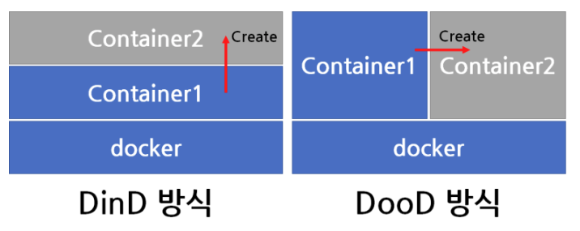

# Jenkinsfile 작성하기

## Jenkinsfile을 읽는 기준

Jenkinsfile은 Jenkins의 item의 설정인 pipeline에서 지정한 **Branch Specifier**에 적힌 branch에 위치한 것을 읽는 것이다.

그리고 바로 아래의 Script Path는 해당 Jenkinsfile이 어느 경로에 위치하는지를 적어주면 된다.

## Branch

만약 특정 branch에서만 빌드를 진행하고 싶다면 when을 사용하여 branch를 지정할 수 있다.

단, 이 방식은 빌드 기록은 남기 때문에 기록조차 남기고 싶지 않을 경우, triggers를 이용할 수 있다.

## DinD, DooD



Gitlab과 연동이 끝나, ec2로 빌드를 하려 했으나 `docker: not found`를 만나게 되었다.

jenkins가 설치되어 있는 docker안에 docker가 없기 때문에 jenkins가 docker 명령을 실행시키지 못하기 때문에 이므로, jenkins가 docker를 실행시킬 수 있도록 해야 한다.

이 방식으로 DinD와 DooD가 존재한다.

### DinD(Docker in Docker)

도커 컨테이너 내부에 새로운 컨테이너를 실행시키는 방법이다.

아직 자세히 알아보진 않았지만 이 방식은 기술적인 결함이 존재하기 때문에 권장되지 않는다고 한다.

### DonD(Docker out of Docker)


DooD는 DinD처럼 Inner Docker를 띄우는 것이 아니라 호스트 도커에 컨테이너를 병렬로 실행시키는 방법이다.

이 방법을 사용하면 인스턴스가 독립적이지 않게 되지만 DinDㅢ 문제를 우회할 수 있다고 한다.

DonD를 하는 방법은 컨테이너 실행 시에 호스트 도커 소켓을 컨테이너에 마운트 시켜주는 방식으로 쉽게 가능하다.

`-v var/run/docker.sock:/var/run/docker.sok`

## Jenkinsfile

```
pipeline {
    agent any

    triggers {
        gitlab(
            branchFilterType: 'NameBasedFilter',
            includeBranchesSpec: 'springtest',
            triggerOnPush: true
        )
    }

    environment {
        DOCKER_IMAGE = "dreamingj98/springtest"
        DOCKER_CONTAINER = "springtest"
    }

    stages {
        stage('Build and Push Docker Image') {
            steps {
                dir('backend') {
                    withCredentials([usernamePassword(
                        credentialsId: 'dockerhub-credential',
                        usernameVariable: 'DOCKER_USER',
                        passwordVariable: 'DOCKER_PASSWORD'
                    )]) {
                        script {
                            sh """
                                echo ${DOCKER_PASSWORD} | docker login -u ${DOCKER_USER} --password-stdin
                                docker build -t ${DOCKER_IMAGE}:latest .
                                docker push ${DOCKER_IMAGE}:latest
                            """
                        }
                    }
                }
            }
        }

        stage('Deploy to EC2') {
            steps {
                script {
                    withCredentials([
                        usernamePassword(
                            credentialsId: 'dockerhub-credential',
                            usernameVariable: 'DOCKER_USER',
                            passwordVariable: 'DOCKER_PASSWORD'
                        ),
                        string(
                            credentialsId: 'ec2-server',
                            variable: 'EC2_SERVER'
                        ),
                        sshUserPrivateKey(
                            credentialsId: 'ec2-ssh-key',
                            keyFileVariable: 'SSH_KEY'
                        )
                    ]) {
                        sh """
                            ssh-keyscan -H \$(echo \${EC2_SERVER} | cut -d@ -f2) >> ~/.ssh/known_hosts
                            ssh -i \${SSH_KEY} \${EC2_SERVER} '
                                echo ${DOCKER_PASSWORD} | docker login -u ${DOCKER_USER} --password-stdin

                                docker stop ${DOCKER_CONTAINER} || true
                                docker rm ${DOCKER_CONTAINER} || true

                                docker pull ${DOCKER_IMAGE}:latest
                                docker run -d \
                                    --name ${DOCKER_CONTAINER} \
                                    -p 8080:8080 \
                                    --restart unless-stopped \
                                    ${DOCKER_IMAGE}:latest

                                docker logout
                            '
                        """
                    }
                }
            }
        }
    }

    post {
        always {
            sh 'docker logout'
            cleanWs()
        }
        success {
            echo 'Build successful!'
        }
        failure {
            echo 'Build failed!'
        }

    }
}
```