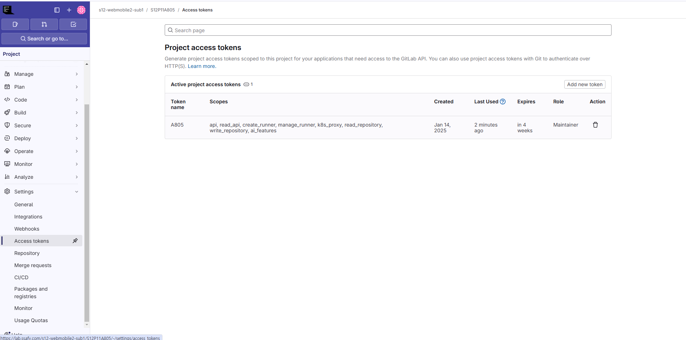
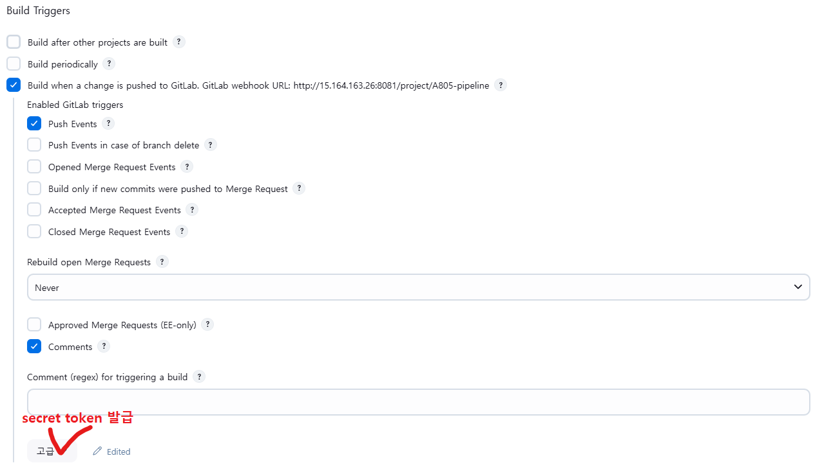
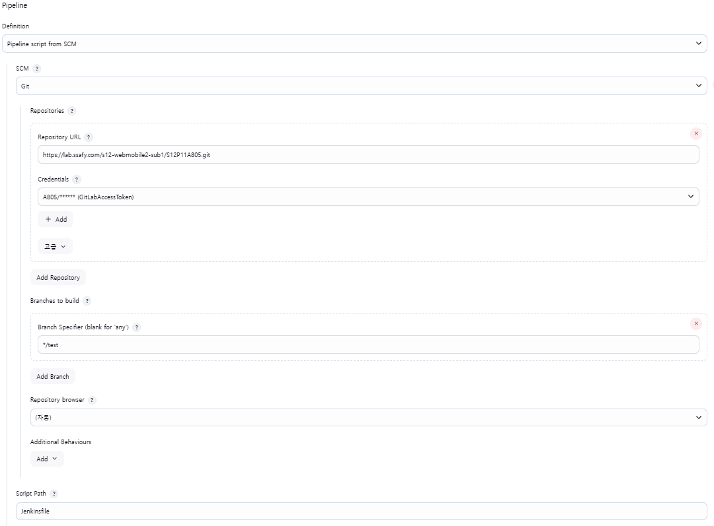

# Jenkins와 Gitlab 연동하기

### 1. **Jenkins 소개**

- **Jenkins란?**
    - Jenkins는 오픈 소스 자동화 서버로, 주로 **지속적 통합(CI)** 과 **지속적 배포(CD)** 작업을 자동화하는 데 사용됩니다.
    - 다양한 플러그인과 확장성 덕분에 다양한 개발 파이프라인을 관리할 수 있습니다.
- **Jenkins의 주요 특징**
    - **자동화된 빌드 및 테스트**: 코드가 커밋될 때마다 자동으로 빌드하고 테스트하여 빠르게 문제를 발견할 수 있습니다.
    - **플러그인 확장성**: 다양한 플러그인을 사용하여 CI/CD 파이프라인을 확장하고 설정할 수 있습니다.
    - **분산 빌드**: 여러 머신을 사용하여 빌드를 분산시킬 수 있습니다.
    - **멀티 플랫폼 지원**: Windows, Linux, macOS 등 다양한 플랫폼에서 실행 가능합니다.

### 2. **Jenkins 주요 구성 요소**

- **Jenkins 파이프라인**
    - **파이프라인 정의**: Jenkins 파이프라인은 여러 단계의 빌드, 테스트, 배포 등을 자동화하는 프로세스입니다.
    - **Jenkinsfile**: 파이프라인을 코드로 정의할 수 있는 방법입니다. Groovy 언어를 사용하여 파이프라인을 작성합니다.
- **작업(Job)**
    - Jenkins에서 실행할 개별 작업을 "Job"이라고 부릅니다. 각 Job은 빌드, 테스트, 배포 등의 작업을 수행합니다

### 3. **Jenkins와 GitLab 연동 방법**

Jenkins와 Gitlab을 연동하기 위한 순서는 다음과 같다.

0. Plugin 설치

    - Credentials

    - Git

    - GitLab

    - Docker

    - Defalut plugin(기본값)

1. GitLab에서 Access Token 발급받기
    - 

2. Jenkins에서 관리 -> System 설정하기

    - GitLab(Credentials도 생성)

3. Jenkins에서 새로운 Item 만들기(Pipeline으로)

4. Jenkins에서 해당 Item의 Configure 설정
    - Build Triggers(GitLab Webhooks를 위한 secret token 발급)
      

    - Pipeline
      

5. GitLab에서 Webhooks 설정
    - Build Triggers에서 받은 secret token 사용

6. 루트 디렉토리에 Jenkinsfile 작성

7. GitLab에 커밋 시 Jenkins 빌드 확인 - 끝


### 4. **Jenkins 파이프라인**

- **Declarative vs Scripted 파이프라인**
    - **Declarative Pipeline**: 선언적 방식으로 파이프라인을 작성하는 방법입니다. 비교적 직관적이며 코드 가독성이 좋습니다.
    - **Scripted Pipeline**: Groovy 스크립트를 이용한 유연한 파이프라인 작성 방법입니다.
- **파이프라인**
    - **파이프라인(Jenkinsfile)** :
    **Groovy // mkdir로 확인하기**
        
        ```groovy
        pipeline {
            agent any
            
            triggers {
                gitlab(
                    triggerOnPush: true, 
                    triggerOnMergeRequest: false, 
                    branchFilterType: 'NameBasedFilter',
                    includeBranchesSpec: 'test',
                    secretToken: '--'
                )
            }
            
            stages {
        
                stage('Checkout') {
                    steps {
                        checkout([
                            $class: 'GitSCM',
                            branches: [[name: '*/test']],
                            userRemoteConfigs: [[
                                url: 'https://lab.ssafy.com/s12-webmobile2-sub1/S12P11A805.git',
                                credentialsId: 'GITLAB_ACCESS_TOKEN'
                            ]]
                        ])
                    }
                }
                
                stage('Create Test Directory') {
                    steps {
                        script {
                            // 현재 시간을 포함한 디렉토리 이름 생성
                            def timestamp = new Date().format('yyyyMMdd_HHmmss')
                            def dirName = "test_${timestamp}"
                            
                            // EC2에 SSH로 접속하여 디렉토리 생성
                            sshagent(['ec2-server']) {
                                sh """
                                    ssh -o StrictHostKeyChecking=no ec2-user@52.79.239.182 '
                                        sudo mkdir -p /home/ec2-user/${dirName}
                                    '
                                """
                            }
                        }
                    }
                }
            }
            
            post {
                success {
                    echo 'Directory creation successful!'
                }
                failure {
                    echo 'Directory creation failed!'
                }
            }
        }
        
        ```